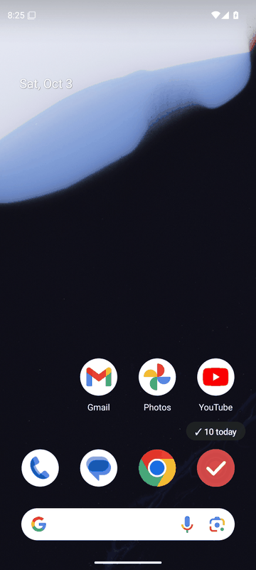
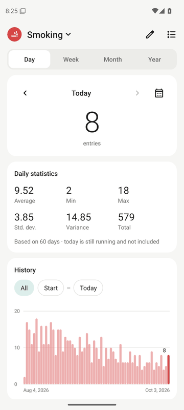
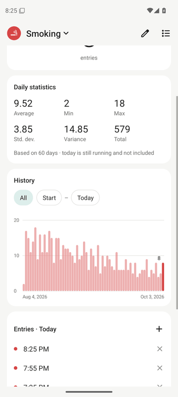
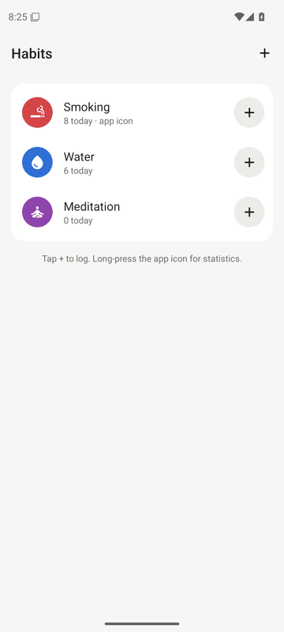
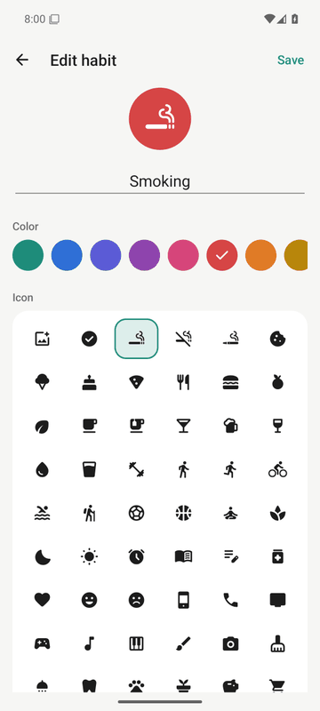

# Habit Tracker

**Tap an icon to count a habit, without leaving your home screen.**

A minimalist Android app. Each habit you track (smoking, water, walks, sleep,
meditation…) gets its own home-screen icon. Tap it and a timestamp is recorded,
confirmed by a short animation right over the icon, and you stay where you were.
Long-press for statistics.

[](https://github.com/MendyAr/habit-tracker/actions/workflows/ci.yml)
[](https://github.com/MendyAr/habit-tracker/releases/latest)

[](LICENSE)

| Tap: logged in place | Long-press: statistics | History & entries | Your habits | Make it yours |
| :---: | :---: | :---: | :---: | :---: |
|  |  |  |  |  |

<sub>Screenshots are taken automatically by the instrumented tests on an Android 15 emulator.</sub>

## Download

Get **`HabitTracker-vX.Y.Z.apk`** from the
[latest release](https://github.com/MendyAr/habit-tracker/releases/latest)
and open it on your phone. Allow your browser or file manager to *install unknown
apps* if Android asks. It runs on **Android 5.0 (2014) and newer** and is ready to
use right after installation, with no account, setup or permissions.

To update, install the newer APK over the old one; your data stays.

## How to use

| Do this | To |
| --- | --- |
| **Tap** the Habit Tracker icon | Log a timestamp. A check pops over the icon with today's count, and that's it. |
| **Long-press** the icon → *Statistics* | Open the statistics (Android 7.1+). On older Android use the separate *Habit stats* icon. |
| Long-press → *Habits* → **+** | Add another habit: name it, pick an icon and a colour. |
| In a habit's settings → *Add icon to home screen* | Give the habit its own icon. Tapping it logs that habit. |
| In a habit's settings → *Add one-tap widget* | Same, as a 1×1 widget that confirms inside the widget itself. |

The first tap after installing also shows a one-time hint about long-pressing.

### Statistics

- **Day / Week / Month / Year**: the period everything below is grouped by.
- **Count card**: the number of logs today (or this week/month/year). Use the
  arrows or the calendar to see any other day or period.
- **Statistics per period**: average, min, max, standard deviation and variance
  of the per-period counts, plus the total. Periods with zero logs count as 0.
  The period still in progress (e.g. today) is left out so a half-finished day
  doesn't drag the average down. The caption says when that happens.
- **History chart**: one bar per period. By default it spans all your data; tap
  the start or end date to narrow it, or *All* to reset. Tap or drag across the
  bars to inspect one, which also selects it in the count card.
- **Entries**: the individual timestamps of the selected period. Tap **+** to add
  one you forgot, or tap an entry to delete an accidental tap.

Your choice of period and chart window is remembered for each habit.

### Making each habit your own

Open a habit's settings (the pencil on its statistics, or tap it in *Habits*):

- **Name**, e.g. "Smoking tracker".
- **Icon**: 65 built-in icons (cigarette, no-smoking, sweets, food, coffee, water,
  workout, walk, run, cycling, sleep, wake up, meditation, reading, medication,
  …), or **your own image** from the gallery.
- **Colour**: ten accents.
- **The app icon logs this habit**: choose which habit the main app icon counts.
- **Delete habit**: removes it, its entries and its home-screen icon.

Renaming or re-iconing a habit updates its home-screen icon and widget too.

## Good to know

- **"Does anything open when I tap?"** Android can only run an app's code on an
  icon tap by starting a window. Habit Tracker's window is completely
  transparent, has no open or close animation, and closes itself after the
  confirmation, so you only ever see your home screen. The widget variant
  doesn't open a window at all.
- **Why can't the main app icon be renamed?** Android fixes an app's own icon and
  name at install time. Per-habit icons are home-screen shortcuts, which can be
  renamed and re-iconed at any time, so use those for named habits.
- **"Covariance"**: for a single series, covariance with itself is the variance.
  The app shows the variance and the standard deviation.
- **Privacy**: no internet permission, no ads, no analytics. Everything stays on
  your phone and is included in Android's backup and phone-to-phone transfer.

## Building from source

Requirements: JDK 17 and the Android SDK (API 35). Then:

```sh
./gradlew assembleDebug            # app/build/outputs/apk/debug/app-debug.apk
./gradlew :core:test :app:testDebugUnitTest   # JVM + Robolectric tests
./gradlew :app:lintDebug
./gradlew :app:connectedDebugAndroidTest      # on a connected device/emulator
```

`./gradlew assembleRelease` produces a minified APK signed with the repository's
sideload key; see [docs/RELEASING.md](docs/RELEASING.md) for releases and
signing with your own key.

## Project layout

```
core/   pure Kotlin: periods, bucketing, statistics (JVM unit tests)
app/    the Android app (framework only, no runtime libraries)
docs/   architecture and release notes
tools/  scripts that import the icon set and render the legacy launcher icons
```

The design, data model and test strategy are described in
[docs/ARCHITECTURE.md](docs/ARCHITECTURE.md). Changes are listed in the
[changelog](CHANGELOG.md).

## Continuous integration

Every push builds the app, runs the unit and Robolectric tests and Android
lint, uploads the APKs as a build artifact, and runs the instrumented tests on
emulators with **Android 5.0, 10 and 15**. When the default branch carries a
new version number and CI is green, a GitHub release with the signed APK is
published automatically.

## License

[MIT](LICENSE). Icons are [Material Symbols](https://github.com/google/material-design-icons)
by Google, Apache License 2.0 (see [NOTICE](NOTICE)).
